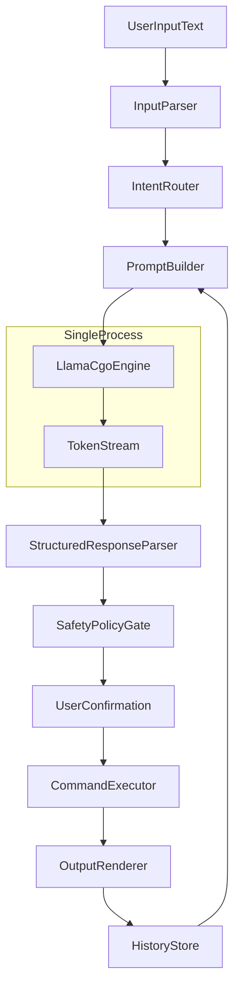

# Roadmap: NL Shell на Go + локальная llama.cpp

## 1) Цели и границы MVP
- Сделать CLI-shell, где пользователь пишет обычным языком, а система предлагает/выполняет команды.
- Linux-first: поддержка bash/zsh окружения, POSIX-команд и пайпов.
- LLM локально через `llama.cpp`, встроенный напрямую в бинарь через CGO (без HTTP, без сабпроцессов).
- Один self-contained бинарь `nlsh` + GGUF файл модели на диске.
- Режимы работы MVP:
  - `ask`: только объяснение/совет, без выполнения.
  - `suggest`: генерирует команду и просит подтверждение.
  - `execute`: выполняет только после явного `y/yes`.

## 2) Архитектура (MVP)

- `InputParser`: нормализация текста (trim, язык, короткая эвристика intent).
- `PromptBuilder`: собирает системный промпт + контекст cwd, OS, последние команды.
- `LlamaCgoEngine`: встраиваемый движок llama.cpp через CGO, держит загруженную модель и `llama_context` в памяти процесса.
- `TokenStream`: построчный приём токенов из CGO callback в Go-канал, с поддержкой отмены через `context.Context`.
- `StructuredResponseParser`: принимает JSON-ответ LLM (не free-form).
- `SafetyPolicyGate`: блокирует рискованные команды (`rm -rf /`, `mkfs`, `:(){:|:&};:` и т.д.).
- `CommandExecutor`: запускает через `exec.CommandContext`, захватывает stdout/stderr/exit code.

## 3) Формат контракта с LLM (ключ к надежности)
- Требовать от модели строго JSON:
  - `intent`: `run_command | explain | ask_clarification`
  - `command`: строка команды (если есть)
  - `explanation`: зачем команда
  - `risk_level`: `low | medium | high`
  - `needs_confirmation`: bool
- Если JSON невалиден -> retry с repair-подсказкой, затем fallback в `ask_clarification`.
- Промпт должен явно запрещать побочные действия без подтверждения.

## 4) Технологический стек Go
- CLI framework: `cobra` (команды, флаги, help).
- Конфиг: `viper` или минимально `encoding/json` + `~/.config/nlsh/config.json`.
- Логирование: `slog`.
- TUI/интерактив (этап 2): `bubbletea` + `lipgloss` (не обязательно в MVP).
- Тесты: `testing` + golden tests для prompt/response parsing.
- LLM: CGO-биндинги к `llama.cpp`. Варианты:
  - использовать `github.com/go-skynet/go-llama.cpp` как стартовую точку,
  - либо собственная тонкая обёртка над публичным C API (`llama.h`) — больше контроля и меньше зависимостей.

## 4.1) CGO/сборка
- `llama.cpp` подключается как git submodule в `third_party/llama.cpp`.
- В пакете `internal/llm` — Go-файл с `// #cgo` директивами:
  - `#cgo CFLAGS: -I${SRCDIR}/../../third_party/llama.cpp -O3`
  - `#cgo LDFLAGS: -L${SRCDIR}/../../third_party/llama.cpp/build -lllama -lggml -lm -lstdc++`
- Опциональные ускорители через build tags:
  - `cuda`, `metal`, `openblas`, `vulkan` -> разные `LDFLAGS` и пресборка llama.cpp.
- Makefile/`build.sh`:
  - шаг 1: `cmake` сборка `llama.cpp` (static lib).
  - шаг 2: `go build -tags cpu` (или cuda/metal).
- Релизы: статически слинкованный бинарь под Linux x86_64/arm64.

## 5) Пошаговая реализация

### Этап A — Bootstrapping и CGO (2-3 дня)
- Инициализировать Go модуль, базовую CLI-команду `nlsh`.
- Добавить подкоманды:
  - `nlsh ask "..."`
  - `nlsh run "..."`
  - `nlsh repl`
- Подключить `llama.cpp` как submodule, написать `Makefile` для сборки статической библиотеки.
- Реализовать минимальную CGO-обёртку в `internal/llm`:
  - `Engine.Load(modelPath, params)` -> `llama_model_load_from_file` + `llama_new_context_with_model`.
  - `Engine.Generate(ctx, prompt, opts)` -> токенизация, eval, sampling loop, выдача токенов в Go-канал.
  - `Engine.Close()` -> освобождение `llama_context`/`llama_model`.
- Корректная обработка отмены: проверка `ctx.Done()` в loop генерации, прерывание sampling.
- CLI-флаги: `--model`, `--threads`, `--ctx-size`, `--gpu-layers`.

### Этап B — Надежный NL -> Command пайплайн (2-4 дня)
- System prompt + few-shot примеры для Linux shell-задач.
- Парсинг структурированного JSON-ответа.
- Политики безопасности (denylist + heuristic risk scoring).
- Confirm step перед выполнением (всегда для `medium/high`).

### Этап C — REPL и UX (2-3 дня)
- Интерактивный цикл: история, `Ctrl+C`, повтор последней команды.
- Рендеринг: показать
  - предложенную команду,
  - объяснение,
  - риск,
  - запрос подтверждения.
- Сохранение короткой истории сессии (локально).

### Этап D — Контекст и качество (3-5 дней)
- Добавить контекст: `cwd`, `ls` snapshot, последние N команд.
- Ограничение контекста токен-бюджетом (truncate + приоритет источников).
- Кеширование частых intent-паттернов.

### Этап E — Hardening (3-5 дней)
- Таймауты/отмена (`context.WithTimeout`) с прерыванием CGO loop по флагу.
- Грамотная работа с памятью: единичная загрузка модели на процесс, переиспользование `llama_context` между запросами в REPL, явный `Close` при выходе.
- Защита от падений из C-кода: `runtime.LockOSThread` в горутине инференса, panic-guard на Go-стороне, recover от SIGSEGV через отдельный helper-процесс (опционально).
- Sandbox-поведение (опционально): запуск пользовательских команд в ограниченном окружении.
- Набор интеграционных тестов: happy path + dangerous prompts + malformed JSON + cancel during generation.
- Метрики локально: latency, tokens/sec, parse-fail rate, confirm rate.

## 6) Модель и инференс (для легковесности)
- Начать с instruct-модели 3B-8B в GGUF, квантование Q4_K_M/Q5.
- Для слабого железа: 3B-4B + короткий контекст + low temperature.
- Базовые параметры генерации:
  - `temperature`: 0.1-0.3
  - `top_p`: 0.9
  - `max_tokens`: минимально достаточный для JSON
  - stop-токены под JSON-формат

## 7) Безопасность по умолчанию
- Не выполнять ничего автоматически без explicit confirm.
- Блокировать команды с red flags по regex и AST-like эвристикам.
- Добавить `--dry-run` как дефолтный режим на раннем этапе.
- Лог действий локально для аудита (без чувствительных секретов).

## 8) Критерии готовности MVP
- >=80% корректных предложений команд на целевом наборе сценариев.
- 0 автоматических выполнений high-risk команд.
- Время ответа <=2-4s на типовых запросах (локально, с warm model).
- Понятный fallback: если не уверен, задает уточняющий вопрос вместо "галлюцинации".

## 9) После MVP (v2)
- Поддержка пайплайнов из нескольких шагов с планом выполнения.
- Плагины-инструменты (`git`, `docker`, `kubectl`) с отдельными policy rules.
- Профили под разные shell (`bash`, `zsh`, позже fish).
- Мини-RAG по `man`/локальной документации для точных аргументов команд.

## 10) Риски и как снижать
- Нестабильный формат ответа LLM -> жесткий JSON контракт + repair loop.
- Ложные/опасные команды -> confirm gate + denylist + тесты adversarial prompts.
- Медленная работа на слабом CPU -> меньшая модель, квантование, ограничение контекста.
- Плохая UX при ошибках -> ясные подсказки и recover flow в REPL.
- Сложность CGO-сборки и кросс-компиляции -> зафиксировать версию `llama.cpp` через submodule, держать `Makefile` с явными целями `cpu/cuda/metal`, CI-сборка под Linux x86_64/arm64.
- Нестабильность C API между версиями `llama.cpp` -> закрепить commit submodule, обновлять осознанно с прогоном тестов; обёртку держать тонкой, чтобы менять только её.
- Утечки памяти/SIGSEGV из нативной части -> единая точка `Engine.Close`, тесты на повторные load/unload, опциональный режим helper-процесса для изоляции инференса.
